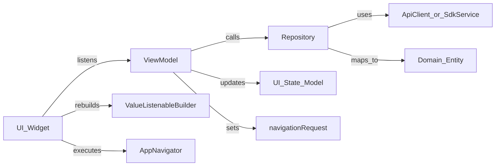

# Architecture Blueprint — Feature-Driven Layered Flutter Apps

This document is a **portable architectural blueprint** for refactoring any Flutter application to match the organization’s Feature-Driven Layered Architecture. AI agents and engineers should treat this file as the source of truth for structure, code quality, logic organization, and Sovereign Pay SDK integration.

**Placement:** This file is intended to live at the **host project root** as `ARCHITECTURE_BLUEPRINT.md` (alongside `AGENTS.md`, `pubspec.yaml`, and `lib/`).

**Companion document:** [`AGENTS.md`](AGENTS.md) (operational rules for AI agents; same project root).

**Reference implementation:** The `code_quality_demo` repository demonstrates many of these patterns. Prefer this blueprint over demo shortcuts when they conflict (for example: missing ViewModels, DTOs living in the wrong layer, or Sovereign Pay SDKs declared only as `dev_dependencies`).

---

## 1. Purpose & Scope

### Goals
- Provide a complete, agent-usable specification for folder structure, layers, state management, navigation, resources, and quality gates.
- Ensure apps that use **Sovereign Pay Card** and **Sovereign Pay Utility** SDKs integrate them correctly within the layered architecture.
- Enable consistent refactoring of existing Flutter apps toward this architecture.

### Non-goals
- This is not a full Sovereign Pay SDK API tutorial. Use each SDK’s `README.md` for API details and parameter lists.
- Do not invent undocumented SDK APIs.
- Do not add optional packages by default.

### How agents should use this document
1. Read this blueprint fully before restructuring code.
2. Follow [`AGENTS.md`](AGENTS.md) for behavioral / workflow rules.
3. Execute the [Refactoring Playbook](#12-agent-refactoring-playbook) in order.
4. Verify with `dart format .` and `dart analyze` (or `flutter analyze`) until clean.

Replace `<app_package>` in examples with the target app’s pubspec `name`.

---

## 2. Environment & Tooling

### Flutter version (mandatory)
- All applications **must** use Flutter **3.41.5** unless the organization explicitly states otherwise.
- Version consistency is required for build stability and Sovereign Pay SDK compatibility.
- **How** Flutter is installed is irrelevant: FVM, asdf, a system install, or CI images are all fine **as long as the active Flutter version is 3.41.5**.
- Do **not** require FVM or a `.fvmrc` file unless the host project already uses them.

### Verification & formatting (mandatory)
- After every submission: run `dart format .` and `dart analyze` (or `flutter analyze`).
- Fix all reported issues before considering the work complete.

### Lint baseline
- Port or adapt a strict `analysis_options.yaml` (see the reference project’s file).
- Architecture-critical rules to preserve:
  - `avoid_relative_lib_imports` (enforce package imports)
  - Prefer `const` constructors / declarations where practical
  - `avoid_print` (use `AppLogger` instead)
  - Naming, null-safety, and return-type clarity rules as defined in the reference lint set

---

## 3. Dependencies

### Mandatory runtime dependencies
Add under `dependencies:` (never as `dev_dependencies` for production app code):

```yaml
dependencies:
  flutter:
    sdk: flutter
  provider: ^6.1.1
  sovereign_pay_card:
    git:
      url: https://github.com/Sovereign-Pay-LTD/Plugins_SDK_Card.git
      ref: main
  sovereign_pay_utility:
    git:
      url: https://github.com/Sovereign-Pay-LTD/Plugins_SDK_Utility.git
      ref: main
```

Then:

```bash
flutter pub get
dart run sovereign_pay_card
dart run sovereign_pay_utility
```

Failure to run both pre-setup commands may cause failed SDK calls at runtime.

### Optional dependencies
Add **only** when the target app already uses them or a feature clearly requires them:

| Package | When to add |
|---------|-------------|
| `http` (or another HTTP client) | REST / custom API stack via `BaseApiClient` (or equivalent) |
| `flutter_secure_storage` | Persisting tokens/secrets locally |

Agents must **not** add optional packages by default during a pure architecture refactor.

### Prohibited state-management libraries
- Bloc, Riverpod, GetX, and similar libraries are **strictly prohibited**.
- Use **only** `provider` for dependency injection and cross-component wiring.
- In-ViewModel reactive state uses `ValueNotifier` + `ValueListenableBuilder` / `ListenableBuilder` (see §7).

### Minimalism
- Avoid unnecessary new packages.
- Prefer existing project utilities or core Flutter APIs before adding dependencies.

---

## 4. Architectural Overview

The architecture is a **Feature-Driven Layered Architecture**, aligned with the [Flutter layered architecture](https://docs.flutter.dev/app-architecture/concepts#layered-architecture).

### Layers

#### Data (`data`)
Entry point for data into the application.
- API clients and path constants
- Repositories coordinating network, local storage, and SDK wrappers
- DTOs with JSON serialization (`fromJson` / `toJson`)
- Local storage / logging / analytics services
- **Sovereign Pay SDK wrappers / facades**

**Strict rule:** Data models (DTOs) and raw SDK request/response types must not leak into the UI layer. Map them in the repository (or domain mapping) to domain entities or UI-safe results.

#### Domain / Logic (`domain`)
Core business objects and rules, independent of Flutter UI and data-source details.
- Entities / domain models
- Enums
- Extensions (preferred way to add behavior to entities without modifying the entity class)
- Mixins (when shared behavior is appropriate)
- Use cases (optional; use when business logic is too complex for the ViewModel–Repository path)

**Strict rule:** No Flutter UI widgets, no JSON DTOs, no Sovereign Pay SDK types in domain models.

#### UI (`ui`)
Rendering and user interaction.
- Screens (full-page views)
- Widgets (screen-private and feature-shared)
- ViewModels extending `BaseViewModel`
- UI-specific state models

**Strict rule:** No API request/response DTOs and no raw SDK response types in `ui/`.

### Logic flow

```
UI (Widget)
  → listens to ViewModel (ValueNotifier / Listenable)
ViewModel
  → calls Repository (never another ViewModel; never BuildContext)
Repository
  → uses ApiClient / LocalStorage / SdkService
  → maps DTO or SDK result → Domain Entity
ViewModel
  → updates uiState / dedicated UI state model
  → may set navigationRequest
UI
  → rebuilds via ValueListenableBuilder / ListenableBuilder
  → executes navigation via AppNavigator
```



---

## 5. Canonical Folder Structure

```
lib/
  main.dart
  app.dart
  core/
    data/
      api/                 # BaseApiClient, shared path constants, interceptors
      repositories/        # BaseRepository, shared repositories
      services/            # AppLogger, StorageService, Sovereign Pay facades, Analytics
    domain/
      enums/               # App-wide enums (e.g. UiStateType)
      extensions/          # Global Dart extensions
      mixins/              # Shared mixins (optional)
      models/              # Shared entities and UiState
    resources/
      animations/
      fonts/
      icons/
      images/
      strings/             # AppStrings and localization keys/files
    ui/
      base_viewmodel.dart
      localization/        # LocalizationViewModel, locale helpers
      navigation/          # AppNavigator, AppRouter, AppRoutes, NavigatorRequest
      theme/               # AppTheme, ThemeViewModel, spacing/colors
      widgets/             # AppText, AppButton, shared atomic widgets
  features/
    <feature_name>/
      data/
        api/
        models/            # Request/response DTOs only
        repositories/
        services/          # Feature-scoped data services (optional)
      domain/
        models/            # Feature entities
        extensions/
        enums/
        mixins/            # Optional
      ui/
        <screen_name>/
          screen.dart      # View
          viewmodel.dart   # ViewModel for this screen
          models/          # Dedicated UI state model(s) for this ViewModel
          widgets/         # Private to this screen
        widgets/           # Shared across screens in this feature
```

### Naming & file rules
- **One public class per file**, except `StatefulWidget` + its private `State` class (same file).
- Folders: `snake_case`. Classes: `PascalCase`. Members: `camelCase`.
- Files: `snake_case.dart` (e.g. `posts_repository.dart`, `auth_viewmodel.dart`).
- **Full package imports only:**
  ```dart
  import 'package:<app_package>/features/posts/data/repositories/posts_repository.dart';
  ```
  Relative imports are **prohibited**.

### Feature module examples
Typical features for payment apps: `splash`, `auth` / `activation`, `home`, `payments` / `transactions`, `settings`, `receipts`. Each follows the same `data` / `domain` / `ui` layout.

---

## 6. Core Building Blocks

### 6.1 `BaseViewModel`
Location: `lib/core/ui/base_viewmodel.dart`

Every screen ViewModel and every complex-widget ViewModel **must** extend `BaseViewModel`.

Required capabilities:
- `ValueNotifier<UiState> uiState`
- `ValueNotifier<NavigatorRequest?> navigationRequest`
- Helpers: `setIdle()`, `setLoading()`, `setSuccess([data])`, `setError(String message)`, `refresh()`
- Navigation helpers: `navigateTo`, `pop`, `goHome` — these **only** update `navigationRequest`; they do not call `Navigator` directly
- Proper `dispose()` of notifiers
- **Never** store or use `BuildContext`

Contract sketch:

```dart
abstract class BaseViewModel extends ChangeNotifier {
  final ValueNotifier<UiState> uiState = ValueNotifier<UiState>(UiState.idle());
  final ValueNotifier<NavigatorRequest?> navigationRequest =
      ValueNotifier<NavigatorRequest?>(null);

  void refresh();
  void setIdle();
  void setLoading();
  void setSuccess([dynamic data]);
  void setError(String message);
  void navigateTo(String routeName, {Object? arguments});
  void pop({Object? result});
  void goHome(String homeRoute);

  @override
  void dispose();
}
```

### 6.2 `UiState` & `UiStateType`
Location: `lib/core/domain/models/ui_state.dart`, `lib/core/domain/enums/ui_state_type.dart`

Shared operation state: `idle` | `loading` | `success` | `error`, with optional `message` and `data`.

### 6.3 Dedicated UI state models
- Each ViewModel should have a **dedicated UI model class** (under `ui/<screen>/models/` or `ui/models/`) holding screen state.
- Avoid clustering many loose fields on the ViewModel without a state object.
- For multi-stage screens, include an `enum` stage field on the UI state model and transition through stages explicitly.

### 6.4 Navigation
Location: `lib/core/ui/navigation/`

| Type | Role |
|------|------|
| `AppRoutes` | Route name constants |
| `AppRouter` | `onGenerateRoute` mapping |
| `AppNavigator` | Imperative navigation via `GlobalKey<NavigatorState>` |
| `NavigatorRequest` | Push / pop / goHome commands from ViewModels |

**Pattern:**
1. ViewModel sets `navigationRequest`.
2. Screen listens (in `initState` / `dispose`) and calls `AppNavigator.push` / `pop` / `pushAndRemoveUntil`.
3. Wire `navigatorKey: AppNavigator.navigatorKey` on `MaterialApp`.

ViewModels must **not** call `Navigator.of(context)`. Screens must **not** bury business-driven navigation without going through the ViewModel when the decision is business/state-driven.

### 6.5 Resources
- **Strings:** `AppStrings` (and localization). No hardcoded user-facing strings in UI.
- **Text:** Use `AppText` instead of raw `Text` for consistent styling/translation.
- **Dimensions:** Use `AppSpacing` (or theme spacing tokens). No magic numbers for spacing/padding where shared tokens exist.
- **Assets:** Path constants under `resources/images`, `resources/fonts`, etc.; register assets in `pubspec.yaml`.

### 6.6 Logging
- Use `AppLogger` for all logging.
- Do not use `print` / `debugPrint` directly in app feature code (except inside `AppLogger` itself if that is the implementation).

### 6.7 API & repositories (when networking is needed)
- `BaseApiClient` (or equivalent) in `core/data/api/` for shared headers, auth token attachment, and response handling.
- Feature API clients extend or compose the base client.
- `BaseRepository` provides shared execute/error wrappers if useful.
- Feature repositories map DTOs → domain entities and are injected into ViewModels.

### 6.8 Shared / global ViewModels
Examples: `AuthViewModel`, `ThemeViewModel`, `LocalizationViewModel`.
- Live under `lib/core/ui/...` (or a dedicated feature’s `ui/` if truly feature-owned but app-wide).
- Access via **`provider` at the root** and/or a **documented singleton** pattern.
- Screen ViewModels must **never** depend on other ViewModels. Shared needs go through repositories, services, or core shared ViewModels accessed from the **UI** (widget) layer when composing listenables—not by injecting one ViewModel into another.

---

## 7. State Management & Dependency Injection

### Reactive UI state
- Prefer `ValueNotifier` fields on ViewModels (`uiState`, `navigationRequest`, and dedicated state notifiers as needed).
- Views rebuild with `ValueListenableBuilder` or `ListenableBuilder`.
- `ChangeNotifier.notifyListeners()` via `refresh()` is acceptable for broader rebuilds.

### Dependency injection
- **Mandatory package:** `provider` only.
- Use `provider` to supply repositories, services, and shared ViewModels.
- Construct screen-scoped ViewModels in the screen (or provide them with a screen-scoped provider) and dispose them with the screen lifecycle.
- Design ViewModels and repositories for testability (constructor injection of repositories/services).

### ViewModel constraints (non-negotiable)
1. No `BuildContext` in ViewModels.
2. No ViewModel → ViewModel dependencies.
3. UI data flows through `uiState` and/or dedicated UI state models.
4. Navigation flows through `navigationRequest` → View → `AppNavigator`.
5. Every screen and every complex widget has its own ViewModel.

---

## 8. Model Discipline

| Kind | Location | Contents |
|------|----------|----------|
| Data / DTO | `*/data/models/` | JSON request/response models, serialization |
| Domain entity | `*/domain/models/` | Pure business objects |
| UI model | `*/ui/.../models/` | Display/state models for ViewModels |

**Rules:**
- Map DTO → Entity in the repository (or a dedicated mapper in data/domain).
- Map Entity → UI model in the ViewModel when display shaping is needed.
- Never import `data/models` DTOs from `ui/` screens/widgets.
- Never put Sovereign Pay SDK model types in `ui/` or `domain/models` as the app’s public entity types; wrap/map them.

---

## 9. SOLID Principles

1. **SRP** — One reason to change per class. Repositories coordinate data; they do not render UI. ViewModels orchestrate UI state; they do not embed HTTP/SDK details.
2. **OCP** — Prefer extensions on domain models for new behavior without editing the entity class.
3. **LSP** — Anything extending `BaseViewModel` must work with the same UI listening/navigation patterns.
4. **ISP** — Prefer focused repository abstractions so ViewModels only see methods they need.
5. **DIP** — ViewModels depend on repository/service abstractions, not concrete HTTP clients or raw SDK singletons when a wrapper exists.

---

## 10. Development Standards Checklist

- [ ] Layered feature structure respected
- [ ] Full package imports only
- [ ] One class per file (StatefulWidget exception)
- [ ] ViewModel on every screen / complex widget
- [ ] Dedicated UI state model per ViewModel; stage `enum` when needed
- [ ] Enums / extensions / mixins in their folders within the correct layer
- [ ] No hardcoded UI strings/dimensions (`AppStrings`, `AppText`, `AppSpacing`)
- [ ] `AppLogger` only
- [ ] Public APIs documented with `///`; `TODO` for incomplete work
- [ ] `dart format .` and `dart analyze` clean
- [ ] Keep implementations simple; no over-engineering

### Testing
- Not every minor change requires tests, but ViewModels and Repositories must remain testable via DI.
- Prefer unit tests for ViewModels and repositories when adding non-trivial logic.

---

## 11. Sovereign Pay SDK Integration

Both SDKs are **mandatory** for organizational payment apps. Place them under **runtime** `dependencies` and run their pre-setup commands (§3).

Official repos:
- Card: https://github.com/Sovereign-Pay-LTD/Plugins_SDK_Card.git
- Utility: https://github.com/Sovereign-Pay-LTD/Plugins_SDK_Utility.git

Always defer to each repository’s `README.md` for full API details.

### 11.1 Architectural placement

| Concern | Location |
|---------|----------|
| SDK initialization, cleanup, device info facades | `lib/core/data/services/` (e.g. `svn_card_service.dart`, `svn_utility_service.dart`) |
| Payment / activation / session / transaction flows | Feature modules under `lib/features/...` with repositories calling the facades |
| Domain entities for transactions, activation, users | `features/<feature>/domain/models/` |
| Screens & ViewModels | `features/<feature>/ui/...` |
| App startup init | Splash (or equivalent) ViewModel → core services |

**UI and domain must not** import `package:sovereign_pay_card/...` or `package:sovereign_pay_utility/...` for business data modeling. Only data-layer services/repositories (and the thin UI bridge for context-requiring calls—see §11.4) may talk to the SDKs.

### 11.2 Utility SDK (`sovereign_pay_utility`)

Entry point: singleton `SvnUtility.i`.

**Setup:**
```yaml
dependencies:
  sovereign_pay_utility:
    git:
      url: https://github.com/Sovereign-Pay-LTD/Plugins_SDK_Utility.git
      ref: main
```
```bash
flutter pub get
dart run sovereign_pay_utility
```

**Initialize** (parameters per README / SDK signature), typically during splash/app init via a core service:

```dart
import 'package:sovereign_pay_utility/utility.dart';

final result = await SvnUtility.i.initialize(
  appInfo: /* SvnUtilityAppInfo */,
  terminalType: /* SvnUtilityTerminalTypes */,
  // optional: transactionFlowOptions, printerSetupConfig, countryInfo,
  // debugMode, securityWorkerConfig, logManagerConfig
);
```

**Managers exposed on `SvnUtility.i`:**
- `activationManager` — merchant/device activation
- `sessionManager` — login, session validate, logout
- `transactionManager` — submit, verify, reverse, history, balances, account lookup
- `userManager` — user CRUD / password flows
- `printerManager` — Sunmi / Pax / Wizar / Bluetooth printing
- `countryManager`, `currencyManager`, `configManager`
- `locationManager`, `logManager`, `shareManager`, `qrManager`, `workManager`
- `apiHandler`, `deviceInfo`, `permissionObject`

**Lifecycle:** call `SvnUtility.i.cleanUp()` when releasing resources / shutting down payment flows as appropriate.

Wrap these behind repositories/services that return **app domain types**, not SDK result objects, to the ViewModel/UI.

### 11.3 Card SDK (`sovereign_pay_card`)

Entry point: singleton `SvnCard.i`.

**Setup:**
```yaml
dependencies:
  sovereign_pay_card:
    git:
      url: https://github.com/Sovereign-Pay-LTD/Plugins_SDK_Card.git
      ref: main
```
```bash
flutter pub get
dart run sovereign_pay_card
```

**Initialize:**
```dart
import 'package:sovereign_pay_card/card.dart';
import 'package:sovereign_pay_card/services/read_handler/models/setup.dart';

final result = await SvnCard.i.initialize(
  readSetup: SvnCardReadSetup(
    terminalType: "22", // optional; defaults by device
  ),
);
```

**Handlers / capabilities:**
- `readHandler` — contact / contactless / magstripe read (`read`, `terminateRead`)
- `pinHandler` — encrypted PIN block (`generateBlock`)
- `completionHandler` — finalize card transaction (`run`)
- `mifareHandler` — generic/POS read/write, manufacturer info, `stopProcess`
- `nfcHandler` — `isNfcEnabled`, `openMobileNFCSettings`
- Device: `deviceInfo`, `openWizarDevice()`, `closeWizarDevice()`

Again: expose app-level methods on a data service/repository; map results to domain entities.

### 11.4 BuildContext rule for SDK APIs

ViewModels **must never** hold `BuildContext`.

Some SDK APIs require `context` (examples from READMEs):
- `SvnCard.i.readHandler.read(request: ..., context: context, listen: ...)`
- `SvnUtility.i.printerManager.startPrinting(context, inputData)`
- `printerManager.bluetooth.ensureConnection(context)`

**Required pattern:**
1. ViewModel prepares request parameters / UI command state (no context).
2. View observes the command (or invokes an explicit ViewModel method that returns params, then the View calls the data service).
3. **View** (or a UI-layer helper) calls the data-layer facade **with** `context`.
4. Result is passed back into the ViewModel (callback / returned `Future` handled in the View then `viewModel.onCardReadCompleted(...)`).

Do not “fix” the no-context rule by stuffing `BuildContext` into the ViewModel to call the SDK.

### 11.5 Suggested init sequence (payment apps)

1. Splash / bootstrap ViewModel starts.
2. Initialize theme/locale/storage as needed.
3. Initialize `SvnUtility` via core service; handle failure in `uiState`.
4. Initialize `SvnCard` when the device/flow needs card capabilities.
5. Proceed to activation / session / home based on repository results.
6. On teardown of long-lived payment sessions, call Utility `cleanUp()` (and close card device connections if opened).

---

## 12. Agent Refactoring Playbook

Execute in order when bringing a host app in line with this blueprint:

1. **Toolchain** — Ensure Flutter **3.41.5** is active (any installer). Add mandatory dependencies; run both `dart run` pre-setups. Add optional deps only if required.
2. **Core scaffold** — Create `lib/core` with `BaseViewModel`, `UiState`, navigation (`AppNavigator` / `AppRouter` / `AppRoutes` / `NavigatorRequest`), theme, `AppStrings`, `AppText`, `AppLogger`. Add base API/storage only if the app needs them.
3. **Feature modules** — Reorganize existing screens into `lib/features/<feature>/{data,domain,ui}`.
4. **Data & domain** — Introduce repositories; move DTOs under `data/models`; create domain entities under `domain/models`; add mapping.
5. **ViewModels** — Add a ViewModel + dedicated UI state model for every screen and complex widget; strip business logic out of widgets.
6. **Navigation** — Replace direct `Navigator` usage driven by business logic with `navigationRequest` → `AppNavigator`.
7. **Sovereign Pay** — Add facades under `core/data/services`; wire init on splash; feature repositories call facades; enforce §11.4 for context-requiring APIs.
8. **Resources & style** — Enforce `AppText` / `AppStrings` / `AppSpacing` / `AppLogger` and full package imports.
9. **Quality gate** — Adapt `analysis_options.yaml`; run `dart format .` and `dart analyze` until clean.

### Definition of done (architecture refactor)
- Folder structure matches §5
- Layer rules in §4 and §8 hold
- ViewModel rules in §7 hold
- Both Sovereign Pay SDKs are runtime dependencies with pre-setup completed
- SDK types do not leak into UI
- Analyze/format clean

---

## 13. Extensibility Notes

- Feature API clients should extend/compose a shared base client for headers and errors.
- Shared data (profile, settings) belongs in `lib/core/data/repositories`.
- Prefer composition and extensions over deep inheritance hierarchies.
- When adding a new feature, copy the empty layered folder template first, then fill in data → domain → ui.

---

## 14. Document Map

These files sit at the **host project root**:

| Document | Role |
|----------|------|
| `ARCHITECTURE_BLUEPRINT.md` | This file — portable architecture & refactoring blueprint |
| `AGENTS.md` | AI agent behavioral & workflow rules (companion to this blueprint) |
| Optional project-specific notes | Must not contradict this blueprint for payment apps |

When in conflict between a demo app’s shortcuts and this blueprint, **follow this blueprint**.
